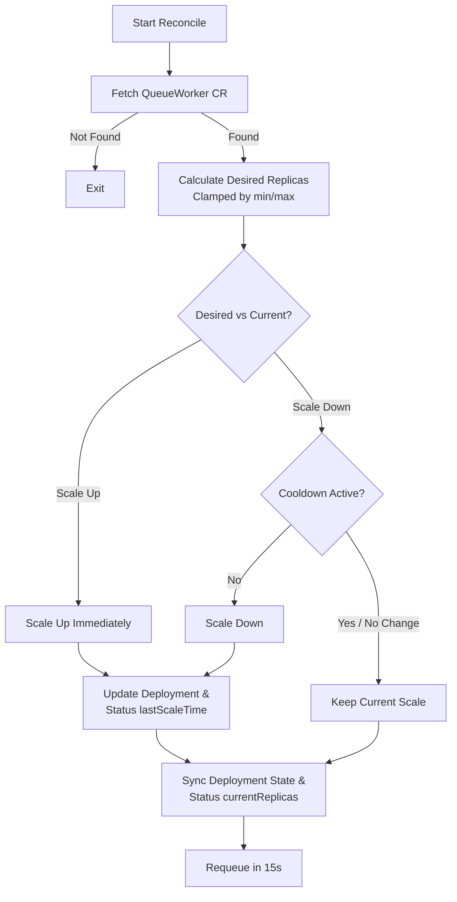

# QueueWorker Operator

A Kubernetes operator written in Go using the **Kubebuilder** framework and `controller-runtime` to autoscale worker deployments dynamically based on queue depth. 

---

## Table of Contents
1. [Overview](#overview)
2. [Architecture & Reconciliation Loop](#architecture--reconciliation-loop)
3. [Custom Resource Definition (CRD)](#custom-resource-definition-crd)
4. [Getting Started](#getting-started)
   - [Prerequisites](#prerequisites)
   - [Local Development](#local-development)
5. [Testing](#testing)
6. [Observability (Prometheus & Grafana)](#observability-prometheus--grafana)
7. [Design Decisions & What I Learned](#design-decisions--what-i-learned)
8. [Checklist & Project Roadmap](#checklist--project-roadmap)
9. [License](#license)

---

## Overview

The **QueueWorker Operator** automates the scaling of worker applications running in Kubernetes. Instead of scaling based on traditional resource usage (like CPU or Memory), it monitors a queue depth (designed for integrations like Redis/SQS; currently using a mock metric source) and scales the replica count of worker `Pods` to match the workload demand.

### Core Features:
- **Queue-Depth Driven Scaling**: Automatically calculates replicas based on `tasksPerPod` metric.
- **Scale-Down Cooldown**: Prevents system "thrashing" (frequent scale-down followed by immediate scale-up) using a customizable cooldown timer.
- **Kubernetes Native Lifecycle**: Fully declarative API using Custom Resource Definitions (CRDs), garbage-collected child deployments, and condition tracking.
- **Prometheus Metrics**: Ready-to-integrate metrics server endpoint for deep observability into scaling activities.

---

## Architecture & Reconciliation Loop

The operator runs a continuous reconciliation loop that observes the current state of the cluster, retrieves the queue depth metrics, and alters the child deployment target to match the desired scale.

### Reconciliation Flow



### Key Mechanisms:
1. **Replica Calculation**: Desired replicas are calculated via:
   $$\text{Desired Replicas} = \min\left(\text{maxReplicas}, \max\left(\text{minReplicas}, \left\lceil \frac{\text{Queue Depth}}{\text{tasksPerPod}} \right\rceil\right)\right)$$
2. **Owner References**: The generated `Deployment` has its `OwnerReference` set to the parent `QueueWorker` CR. When the CR is deleted, Kubernetes automatically garbage collects the deployment resources.
3. **Loop Scheduling**: The controller returns a requeue result (`RequeueAfter: 15 * time.Second`) ensuring the controller polls the queue depth periodically even if no Kubernetes events trigger it.

---

## Custom Resource Definition (CRD)

The operator registers the `QueueWorker` custom resource in the `apps.mystic-06.github.io` API group. 

### Spec Fields (`spec`)
| Field | Type | Description | Required | Validation |
|---|---|---|---|---|
| `queueURL` | `string` | The HTTP/S URL of the queue metric source to monitor. | Yes | - |
| `minReplicas` | `int32` | The minimum number of worker pods that must run. | Yes | `>= 1` |
| `maxReplicas` | `int32` | The maximum number of worker pods allowed to scale to. | Yes | `>= 1` |
| `tasksPerPod` | `int32` | How many queue items single pod can handle. | Yes | `>= 1` |
| `image` | `string` | The Docker image for the worker pods. | Yes | - |

### Status Fields (`status`)
| Field | Type | Description |
|---|---|---|
| `currentReplicas` | `int32` | The actual replica count currently running. |
| `lastScaleTime` | `metav1.Time` | Timestamp of the last scaling modification. |
| `conditions` | `[]metav1.Condition` | Status observations (Ready, Progressing, etc.) of the resource. |

### Sample CR Configuration
```yaml
apiVersion: apps.mystic-06.github.io/v1alpha1
kind: QueueWorker
metadata:
  name: my-queueworker
  namespace: default
spec:
  queueURL: "https://sqs.us-east-1.amazonaws.com/123456789012/my-work-queue"
  minReplicas: 1
  maxReplicas: 10
  tasksPerPod: 10
  image: nginx:alpine
```

---

## Getting Started

### Prerequisites
- **Go**: `1.22+` (project configured with `1.25.7`)
- **Docker**: For building and loading images.
- **kubectl**: For cluster administration.
- **Kind** (Kubernetes in Docker): For local dev cluster environment.

---

### Local Development

1. **Spin up a local Kind cluster**:
   ```bash
   kind create cluster --name operator-dev
   ```

2. **Generate manifests & install CRDs**:
   ```bash
   make manifests generate
   make install
   ```

3. **Run the controller locally**:
   Runs the operator process directly on your host machine bound to your active kubeconfig context:
   ```bash
   make run
   ```

4. **Apply a sample CR**:
   ```bash
   kubectl apply -f config/samples/apps_v1alpha1_queueworker.yaml
   ```

---

## Testing

The project contains unit tests and integration tests (using `envtest`).

### Run Unit and Integration Tests
```bash
make test
```
The integration tests use **envtest**, which spins up a local control plane (etcd + K8s API server) to validate CRUD operations on `QueueWorker` resources, owner references, status changes, and reconciling logic without needing a fully running cluster.

---

## Observability (Prometheus & Grafana)

The operator contains built-in instrumentation leveraging `controller-runtime`'s metrics endpoint. Although Phase 5 is in progress, the metrics schema and configuration setups are designed as follows:

### Exposed Metrics
- `queueworker_scale_events_total`: A Prometheus **Counter** incremented on each scale-up or scale-down event. Includes labels for `namespace`, `name`, and `direction` (`up` / `down`).
- `queueworker_replica_count`: A Prometheus **Gauge** representing current replicas. Includes labels for `namespace` and `name`.
- `queueworker_queue_depth`: A Prometheus **Gauge** representing the tracked queue depth. Includes labels for `namespace`, `name`, and `queue_url`.

### Running Locally with Docker Compose

To test observability metrics locally, spin up a Prometheus and Grafana instance side-by-side using the following `docker-compose.yaml` (saved in your observability tooling directory):

```yaml
version: '3.8'

services:
  prometheus:
    image: prom/prometheus:v2.45.0
    container_name: operator-prometheus
    volumes:
      - ./prometheus.yml:/etc/prometheus/prometheus.yml
    ports:
      - "9090:9090"
    extra_hosts:
      - "host.docker.internal:host-gateway"

  grafana:
    image: grafana/grafana:10.0.0
    container_name: operator-grafana
    ports:
      - "3000:3000"
    environment:
      - GF_SECURITY_ADMIN_PASSWORD=admin
```

Create a matching `prometheus.yml` configuration to scrape the metrics:

```yaml
global:
  scrape_interval: 10s

scrape_configs:
  - job_name: 'queueworker-operator'
    metrics_path: /metrics
    static_configs:
      - targets: ['host.docker.internal:8080'] # Points to the manager running locally via `make run`
```
> **Note**: For metrics scrape to work, ensure the manager is started with `--metrics-secure=false` and `--metrics-bind-address=:8080` (so HTTPS/RBAC wrapper is bypassed during local metrics testing).

---

## Design Decisions & What I Learned

### 1. Scaling Cooldown Logic
**Problem**: Scaling down immediately when queue depth drops can trigger "thrashing". If the queue drops briefly for 5 seconds and spikes again, pods are repeatedly terminated and recreated, adding severe overhead.
**Solution**: Implemented a `30s` cooldown period for scale-down actions (checked via `status.lastScaleTime`). Scale-up requests bypass this cooldown to ensure system responsiveness under sudden load spikes.

### 2. Envtest Integration vs. Mocks
**Problem**: Testing controllers via mock kubernetes clients fails to cover real API server behavior like garbage collection, owner references, and status validation constraints.
**Solution**: Utilized `envtest` for integration tests. It launches an isolated, lightweight control plane (`kube-apiserver` and `etcd`) locally. It is faster than deploying to a local Kind/Minikube cluster, but guarantees that actual API serialization, reconciliation loops, and K8s object relationships work exactly like a production cluster.

---

## Checklist & Project Roadmap

Here is the progress tracker for the QueueWorker Operator project:

- [x] **Phase 1: Prerequisites & Setup**
  - [x] Understand Kubernetes Operator pattern
  - [x] Scaffold the workspace using Kubebuilder
- [x] **Phase 2: Custom Resource Definition (CRD)**
  - [x] Design spec and status schema
  - [x] Auto-generate manifests and deepcopy methods
  - [x] Register and verify CRD in local cluster
- [x] **Phase 3: Controller Implementation**
  - [x] Setup reconciliation loop fetch/not-found logic
  - [x] Implement child Deployment creation/updates via `CreateOrUpdate`
  - [x] Add owner references (`SetControllerReference`)
  - [x] Establish calculation logic and scale-down cooldown
  - [x] Track and update status subresource (`lastScaleTime`, replicas)
- [x] **Phase 4: Testing**
  - [x] Write scaling calculation unit tests
  - [x] Write CRUD/integration tests using `envtest`
  - [ ] Test cooldown logic with `k8s.io/utils/clock.FakeClock`
- [ ] **Phase 5: Observability** (Ongoing)
  - [ ] Add Prometheus Counter for scaling events
  - [ ] Add Prometheus Gauge for active replicas
  - [ ] Setup Prometheus & Grafana scrape configuration
  - [ ] Design custom dashboard for scaling monitoring
- [ ] **Phase 6: Hardening & Distribution**
  - [ ] Add validating webhook (`defaulting --programmatic-validation`)
  - [ ] Restrict RBAC ClusterRole permissions to absolute minimum
  - [ ] Write Helm Chart for single-command installation
  - [ ] Record asciinema demo of operator autoscaling pods

---

## License

Copyright 2026. Licensed under the Apache License, Version 2.0. See [LICENSE](LICENSE) for details.
